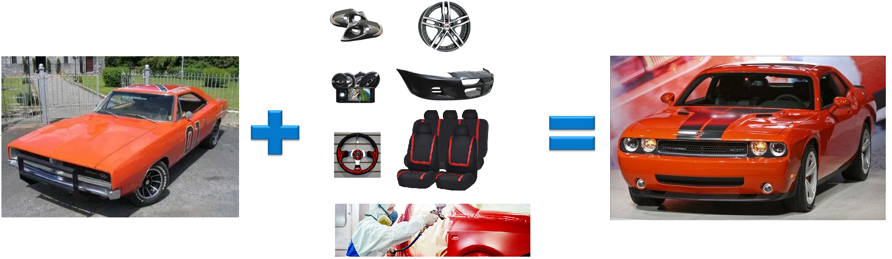

```{r setup, include=FALSE}
knitr::opts_chunk$set(echo = FALSE)
```


# **¿Qué es R?** 

<p ><FONT SIZE=6 COLOR="darkblue"> 

- R es un conjunto integrado de programas para manipulación de datos, cálculos y gráficos. 

- Se trata de un sistema para análisis estadísticos creado por Ross Ihaka y Robert Gentleman. 

- R tiene una naturaleza doble: es un programa y un lenguaje de programación, desarrollado originalmente como una versión libre del lenguaje S, creado por los Laboratorios AT&T Bell.

  </font></p> 
  <br/>

```{r i_1, fig.align='center', out.width = "40%", echo=FALSE, cache=TRUE}


```


# **Entre otras características R dispone de:** 


<p ><FONT SIZE=6 COLOR="darkblue"> 

- Almacenamiento y manipulación efectiva de datos, operadores para cálculo sobre variables indexadas (arreglos y tablas), en particular matrices, lo que permite ejecutar consultas y realizar cálculos de cifras e indicadores, entre otras cosas, 

- Una amplia, coherente e integrada colección de herramientas para análisis de datos, 

- La posibilidad de funcionar como editor de textos (en vinculación con LaTex, por ejemplo), editor de presentaciones y de documentos html y pdf, como software de administración de bases de datos (por ejemplo, con librerías a través de Oracle), e incluso como lenguaje explorador de ficheros (para crear directorios o carpetas, descargar y leer archivos de ubicaciones en red, etc.),

- Enormes posibilidades gráficas para análisis de datos, que funcionan directamente sobre pantalla o impresora, y

- Un lenguaje de programación bien desarrollado, simple y efectivo, que incluye condicionales, ciclos, funciones recursivas y posibilidad de entradas y salidas de distintos tipos.

  </font></p> 
  <br/>


# **Ejemplos de herramientas interactivas que pueden crearse con R** 

<br/>
<p ><FONT SIZE=6 COLOR="darkblue"> 

- Cuadros dinámicos:

</font></p> 

```{r tab1, justify= TRUE, echo=FALSE, warning=FALSE}

library(DT)

bhvs <- read.csv("iteRurlx.csv", encoding = "UTF8")
bhvs <- bhvs[,-1]

DT::datatable(bhvs,filter = 'top', options = list(
   scrollX = TRUE, scrollY = 200, pageLength = 10, language = list(
    info = "Mostrando registros del _START_ al _END_ de un total de _TOTAL_ registros",
    paginate = list(previous = 'Anterior', `next` = 'Siguiente'),
    search =  "Buscar:", lengthMenu = "Mostrar _MENU_ registros" )))

```

<br/>
<br/>

<p ><FONT SIZE=6 COLOR="darkblue"> 

- Mapas:

</font></p> 

Ver ejemplos en el Sitio Web del [**Atlas Nacional de las Abejas y Derivados Apícolas**](https://atlasapi2019.github.io/cap4.html){target="_blank"}.

<br/>
<br/>

<p ><FONT SIZE=6 COLOR="darkblue"> 

- Gráficos como ningún otro programa:

</font></p>

```{r graf1, echo=FALSE, message=FALSE, warning=FALSE, cache =TRUE, out.width = "100%"}
library(plotly)

p <- plot_ly(
  type = 'scatter',
  x = mtcars$hp,
  y = mtcars$qsec,
  text = paste("Fabricante: ", rownames(mtcars),
               "<br>hp: ", mtcars$hp,
               "<br>qsec: ", mtcars$qsec,
               "<br>Cilindros: ", mtcars$cyl),
  hoverinfo = 'text',
  mode = 'markers',
  transforms = list(
    list(
      type = 'groupby',
      groups = mtcars$cyl,
      styles = list(
        list(target = 4, value = list(marker =list(color = 'blue'))),
        list(target = 6, value = list(marker =list(color = 'red'))),
        list(target = 8, value = list(marker =list(color = 'black')))
      )
      )
    )
  )
p
```


# **¡Además R es un software libre!** 

 
- R se distribuye gratuitamente bajo los términos de la GNU General Public License; su desarrollo y distribución son llevados a cabo por varios estadísticos conocidos como el Grupo Nuclear de Desarrollo de R.

- R está disponible en varias formas: el código fuente escrito principalmente en C (y algunas rutinas en Fortran), esencialmente para máquinas Unix y Linux, o como archivos precompilados para Windows, Linux, Macintosh y Alpha Unix.

- Los archivos necesarios para instalar R, ya sea desde las fuentes o archivos precompilados, se distribuyen desde el sitio de Internet [**The Comprehensive R Archive Network (CRAN)**](https://cran.r-project.org/){target="_blank"}, junto con las instrucciones de instalación.


# **RStudio** 

- RStudio es un entorno de desarrollo integrado (IDE) para R. Incluye una consola, editor de sintaxis que apoya la ejecución de código, así como herramientas para el trazado, la depuración y la gestión del espacio de trabajo.

- RStudio es una interfaz de R, aunque no se limita a la función de *enmascarado*. ¡No funcionará en un equipo si no está instalado R!

- Al trabajar en RStudio, nada cambia respecto a la sintaxis y funciones de R, sólo el entorno.

- Abre RStudio, y desde ahí el script del curso (guion.R) para continuar…


# **Librerías** 


- R es una plataforma de programación que constantemente se encuentra actualizándose. Se trata de un software libre, pero no solamente para acceder al mismo, sino también para hacer contribuciones a mejorarlo. Para ello, R cuenta con un repositorio en su página web donde usuarios especializados de todo el mundo comparten librerías (packages) desarrolladas por ellos mismos, y que son paquetes accesorios para R a manera de programas adicionales a la plataforma base, cuya finalidad es realizar funciones específicas en R.

```{r i_2, fig.align='center', out.width = "100%", echo=FALSE, cache=TRUE}



```


# **Instalación de Librerías** 

Abrir en el menú de RStudio ***Tools >> Install Packages*** y escribir el nombre de la librería:

1) rmarkdown
2) knitr
3) DT
4) kableExtra
5) highcharter

Entre muchas otras...


# **RMarkdown** 

El lenguaje de marcado Markdown, a través de su librería en R, llamada **RMarkdown**, permite generar documentos que combinen texto, imágenes e instrucciones de R, más los resultados que dichas instrucciones produzcan (estos resultados pueden ser simples valores numéricos, tablas o gráficos). 

Dichos documentos puede exportarse en tres formatos:

  - html: para ser visualizados a través de navegadores web. Existe la posibilidad de que el documento se exporte como una página web o como una presentación html (similar a Power Point). Las últimas versiones de Rstudio permiten incluso generar sitios web completos, con diferentes páginas enlazadas entre sí.

  - doc: para ser directamente editados con Microsoft Word.

  - pdf: Para esta última opción es preciso que el ordenador del usuario disponga de una instalación válida de LaTeX. LaTeX es un completo (y complejo) sistema de edición de textos de código abierto que puede descargarse libremente para Windows (Miktex), para Mac (Mactex) y para Linux (TexLive, si bien lo habitual es que en los sistemas linux texlive venga ya instalado por defecto).

# **RMarkdown** 

La clave para combinar texto, código R y gráficos es utilizar la sintaxis Rmarkdown. Esta sintaxis se emplea en un simple documento base que contiene el texto y las instrucciones de R, y que será posteriormente procesado a alguno de los formatos anteriores. La sintaxis Rmarkdown consiste simplemente en una colección de marcas que indican:

- Los encabezados de capítulos o subcapítulos.  
- La presencia de **negrillas** o *cursivas*.  
- Los items de una lista.  
- El enlace a una página web.  
- La inserción de una figura.  

Estas marcas consisten simplemente en asteriscos (*), guiones bajos (_), corchetes, comillas, etc., cuyo uso puede verse en la ayuda de Rstudio, en la sección llamada [R Markdown Reference Guide](https://www.rstudio.com/wp-content/uploads/2015/03/rmarkdown-reference.pdf){target="_blank"}

Otros muchos sitios contienen tutoriales sobre el uso de RMarkdown, por ejemplo:

1. [https://rmarkdown.rstudio.com/](https://rmarkdown.rstudio.com/){target="_blank"}

2. [R Markdown: The Definitive Guide](https://bookdown.org/yihui/rmarkdown/){target="_blank"}

3. [Curso de Introducción a R / Generación de documentos en R Markdown](http://www.dma.ulpgc.es/profesores/personal/stat/cursoR4ULPGC/20-Rmarkdown.html){target="_blank"}
 
Entre muchos otros...


